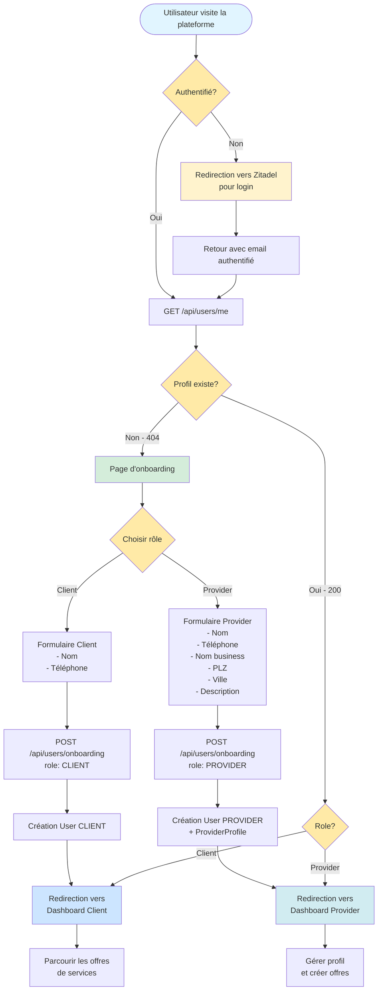

# Flow d'Onboarding Utilisateur

## Détails du Flow

### 1. Première Visite (Nouvel Utilisateur)
1. L'utilisateur arrive sur la plateforme
2. Pas de session → Bouton "Se connecter"
3. Redirection vers Zitadel pour authentification
4. Après login, retour avec email dans les headers
5. Backend vérifie : GET /api/users/me → **404 Not Found**
6. Frontend redirige vers `/onboarding`

### 2. Page d'Onboarding
L'utilisateur remplit un formulaire selon son rôle :

**Pour un Client :**
- Nom
- Numéro de téléphone

**Pour un Provider :**
- Nom
- Numéro de téléphone
- Nom du business
- Code postal (PLZ)
- Ville
- Description (optionnel)

### 3. Soumission
- Frontend envoie POST /api/users/onboarding
- Backend crée :
  - User avec role CLIENT ou PROVIDER
  - Si PROVIDER : également un ProviderProfile

### 4. Redirection Finale
- **Client** → Dashboard pour parcourir les offres
- **Provider** → Dashboard pour gérer son profil et créer des offres

### 5. Visites Suivantes (Utilisateur Existant)
1. L'utilisateur arrive sur la plateforme
2. Session active → Headers d'auth présents
3. Backend vérifie : GET /api/users/me → **200 OK**
4. Frontend redirige directement vers le dashboard approprié
   - Client Dashboard si role = CLIENT
   - Provider Dashboard si role = PROVIDER

## États de l'Utilisateur

| État | Condition | Action |
|------|-----------|--------|
| **Nouveau** | Pas de User en DB | Afficher page d'onboarding |
| **Client** | User avec role CLIENT | Rediriger vers dashboard client |
| **Provider** | User avec role PROVIDER + ProviderProfile | Rediriger vers dashboard provider |